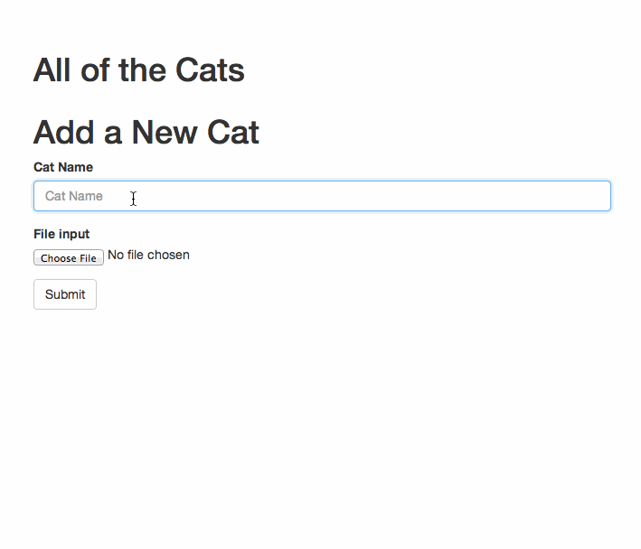

# Cats-ui

## Installation

* `git clone` this repository
* `npm install`
* `bower install`

## Running

* `ember server`
* Visit your app at http://localhost:4200.

## Running Tests

* `ember test`
* `ember test --server`

## Building

* `ember build`

For more information on using ember-cli, visit [http://iamstef.net/ember-cli/](http://iamstef.net/ember-cli/).
